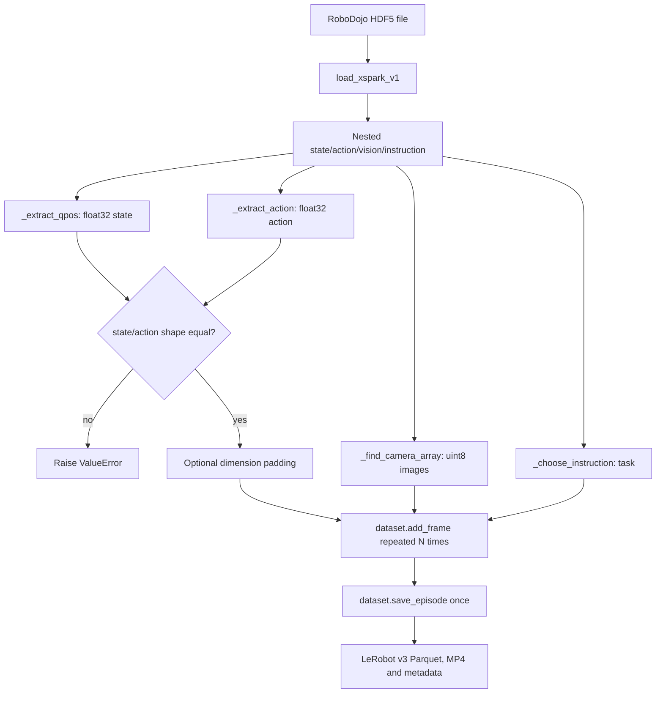

# Week 4 Day 1: LeRobot Dataset Schema and Episode Structure

## 1. 范围与基线

本日只做数据契约和转换链路审计，不安装 LeRobot、不下载数据，也不修改 RoboDojo。

- Embodied-90 commit：`c4e9ceae51a3ff8aae5a7c27a77135032052d03f`
- XPolicyLab commit：`3e6b42cda67ad6c02aaef2fec16815490c328751`
- 主参考转换器：`XPolicyLab/scripts/transform_lerobot_v30_format.py`
- 目标格式：LeRobot v3.0
- 当前 RoboDojo Python 环境：未安装 `lerobot`
- 本机 LeRobot cache：未发现可供核验的数据集

XPolicyLab 同时提供 v2.1 和 v3.0 数据下载入口，不同 policy 子目录也使用不同 LeRobot 版本。因此目前不存在“仓库统一版本”。Week 4 以本地 v3.0 转换器为主线，Day 2 必须先冻结精确版本。

| 证据 | 版本/格式 | 含义 |
| --- | --- | --- |
| `scripts/RoboDojo/download_robodojo_data.sh` | v2.1、v3.0 | XPolicyLab 同时发布两种格式 |
| `policy/A1/A1/requirements.txt` | `lerobot==0.3.3` | 部分 policy 使用旧版 API |
| `policy/Pi_0/openpi/pyproject.toml` | `lerobot==0.4.4` | 部分 policy 使用支持 v3 的新版 API |
| 本地主转换器 | v3.0 | 本周训练链路的首选审计对象 |

官方 v3 文档说明该格式由 `lerobot >= 0.4.0` 支持，并将多个 episode 存入分块 Parquet/MP4 文件；episode 边界由 metadata 恢复，不依赖“一集一个文件”的文件名约定。参考：[LeRobotDataset v3.0](https://github.com/huggingface/lerobot/blob/main/docs/source/lerobot-dataset-v3.mdx) 和 [LeRobotDataset source](https://github.com/huggingface/lerobot/blob/main/src/lerobot/datasets/lerobot_dataset.py)。

## 2. 本地代码索引

以下行号针对 XPolicyLab commit `3e6b42c...` 的当前 dirty worktree，只作为本次快照定位。

| 环节 | 文件与位置 | 函数/对象 | 输入与输出 |
| --- | --- | --- | --- |
| 相机映射 | `transform_lerobot_v30_format.py:35` | `CAMERA_CANDIDATES` | 三路 RoboDojo camera -> LeRobot 图像键 |
| 环境元数据 | 同文件 `:82` | `_load_env_metadata` | env config -> robot、动作维度、FPS |
| 动作维度 | 同文件 `:151` | `_dims_from_robot_action_info` | 每臂 `arm_dim + ee_dim` |
| 字段名称 | 同文件 `:206` | `_build_motor_names_from_dims` | 生成 `left_joint_*`、`right_joint_*` |
| 指令 | 同文件 `:299` | `_find_instructions`、`_choose_instruction` | instruction(s) -> 单条 task |
| 状态拼接 | 同文件 `:362` | `_extract_qpos` | 四段 joint state -> `observation.state` |
| 动作拼接 | 同文件 `:379` | `_extract_action` | 四段 action -> `action` |
| 图像解码 | 同文件 `:450` | `_decode_image_frame` | JPEG/raw array -> `uint8` 图像 |
| schema 创建 | 同文件 `:539` | `create_empty_dataset` | features、FPS、robot type -> 空 v3 dataset |
| episode 写入 | 同文件 `:631` | `convert_one` | 一个 HDF5 -> 多帧 -> 一个 episode |
| 原始 HDF5 读取 | `XPolicyLab/utils/data_loader.py:5` | `load_xspark_v1` | HDF5 -> nested dict |
| 采集频率 | `env_cfg/arx_x5.yml:9` | `observation.collect_freq` | `25 Hz` |
| 机器人维度 | `env_cfg/robot/_robot_info.json:2` | `dual_x5` | arm `[6,6]`、EE `[1,1]` |

## 3. 转换流程

一个输入 HDF5 文件在 `convert_one` 中只调用一次 `save_episode()`，因此源文件与逻辑 episode 一一对应。v3 落盘时可将多个逻辑 episode 合并到同一个 Parquet 或 MP4 chunk，不能通过输出文件数量推断 episode 数量。

## 4. Frame 字段

| 字段 | 本地 schema | 来源 | 已确认语义 |
| --- | --- | --- | --- |
| `observation.state` | `float32[14]` | 机器人 joint state | 左臂、左夹爪、右臂、右夹爪 |
| `action` | `float32[14]` | joint action | 与 state 使用相同顺序和 shape |
| `observation.images.cam_high` | video，声明为 `[3,480,640]` | `vision/cam_head/colors` | 头部相机 |
| `observation.images.cam_left_wrist` | video，声明为 `[3,480,640]` | `vision/cam_left_wrist/colors` | 左腕相机 |
| `observation.images.cam_right_wrist` | video，声明为 `[3,480,640]` | `vision/cam_right_wrist/colors` | 右腕相机 |
| `task` | string | `instruction` 或 `instructions` | 每个源 episode 选择一次 |

`episode_index`、`frame_index`、`timestamp`、`index`、`task_index` 等 bookkeeping 字段由 LeRobot API 和 metadata 管理，不是本地转换器在 frame dict 中手写的字段。实际列名和 dtype 需要 Day 2 对固定版本的数据验证。参考：[dataset_metadata.py](https://github.com/huggingface/lerobot/blob/main/src/lerobot/datasets/dataset_metadata.py)。

## 5. dual-X5 的 14 维顺序

`dual_x5` 定义两条 6-DoF 手臂和两个 1-DoF EE。`_extract_qpos` 与 `_extract_action` 使用相同拼接顺序。

| 索引 | 源字段 | 语义 | 转换器生成名称 |
| --- | --- | --- | --- |
| `0..5` | `left_arm_joint_states` | 左臂 joint 1..6 | `left_joint_0..5` |
| `6` | `left_ee_joint_states` | 左夹爪 | `left_joint_6` |
| `7..12` | `right_arm_joint_states` | 右臂 joint 1..6 | `right_joint_0..5` |
| `13` | `right_ee_joint_states` | 右夹爪 | `right_joint_6` |

生成名称没有显式写出 `gripper`。训练或推理代码不能仅凭名称把第 7/14 维当作普通手臂关节，必须保留机器人配置给出的维度边界。

## 6. Episode 与时间语义

- `num_frames = state.shape[0]`；state/action shape 不一致时立即失败。
- `arx_x5` 目标 FPS 为 `25`，相邻 frame 理想间隔为 `0.04 s`。
- 多条指令存在时，转换器以未显式设 seed 的 `random.choice` 为整个 episode 选择一条。
- dataset 创建时声明三路相机 feature，但 frame 只写入实际存在且当前 index 有效的图像。
- 混合机器人数据时，state/action 可按每臂最大维度补零。
- 官方 v3 目录通常含 `data/`、`videos/`、`meta/`；`info.json`、`stats.json`、`tasks.parquet` 和 episode metadata 描述 schema、统计量、task 与边界。

## 7. 已确认与未决项

| 检查项 | 状态 | 证据或下一步 |
| --- | --- | --- |
| dual-X5 state/action 为 14 维 | Confirmed | robot info + 提取函数 |
| 左/右与夹爪顺序 | Confirmed | `_extract_qpos`、`_extract_action` |
| arx_x5 FPS 为 25 | Confirmed | `arx_x5.yml` |
| 一个源 HDF5 对应一个逻辑 episode | Confirmed | 每次 `convert_one` 只保存一次 |
| v3 多 episode 可共享物理文件 | Confirmed | 官方 v3 文档 |
| 图像送入 LeRobot 后是 RGB 还是 BGR | Unverified | OpenCV JPEG decode 返回 BGR，raw fast path 不转换 |
| 声明 CHW 与传入 HWC 是否由 API 正确处理 | Unverified | feature 为 `[3,H,W]`，fast path 为 `[N,H,W,3]` |
| 缺失已声明相机时的 API 行为 | Unverified | frame 可能缺少对应 key |
| 自动 bookkeeping 字段及 dtype | Unverified | 当前环境未安装 LeRobot |
| task 选择能否复现 | Risk | 脚本未显式固定 Python `random` seed |
| 转换目标目录覆盖行为 | Risk | 同名 dataset root 会被删除 |

颜色与 layout 必须保持为“待验证”，不能由源码阅读直接判定为数据错误。OpenCV 解码路径与未解码 raw array 路径可能产生不同通道约定。

## 8. Day 2 最小验证清单

1. 冻结 LeRobot 版本/commit、Python 和安装命令。
2. 下载一个小型公开 v3 数据集，不覆盖 RoboDojo 数据目录。
3. 检查 info、stats、tasks、episode metadata 和 Parquet schema。
4. 读取首帧、中间帧、末帧，打印每字段 shape、dtype、range。
5. 对同一图像比较原文件、dataset API 输出和可视化结果，明确 RGB/BGR 与 HWC/CHW。
6. 检查相机字段是否逐帧齐全，video 帧数是否等于 episode frame 数。
7. 验证 timestamp 单调、frame index 连续，并与 FPS 一致。
8. 验证 episode 边界和 task/task_index 对应关系。
9. 记录 state/action 统计范围；公开数据若不是 dual-X5，不套用本报告的 14 维语义。

## 9. 结论

本地 RoboDojo 到 LeRobot v3 的核心契约已可追踪：每个 HDF5 形成一个逻辑 episode，每帧包含 task、三路视觉候选、同序 state/action；dual-X5 的 state/action 均为 14 维，顺序为左臂、左夹爪、右臂、右夹爪。当前缺少固定 LeRobot 版本和真实样本，因此图像通道、tensor layout、自动 metadata 字段及缺失相机行为留待 Day 2 实测。
