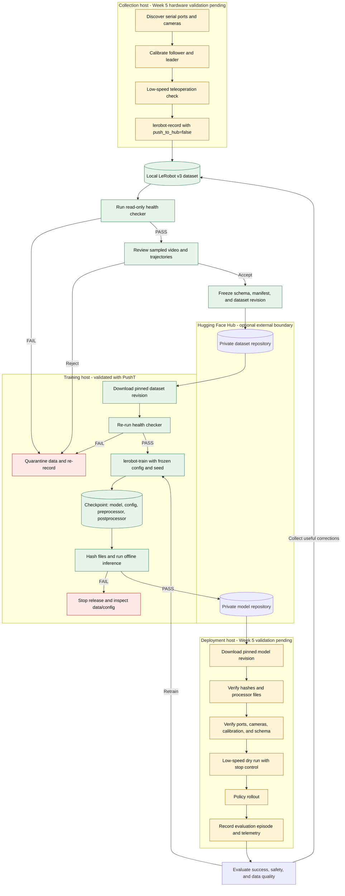
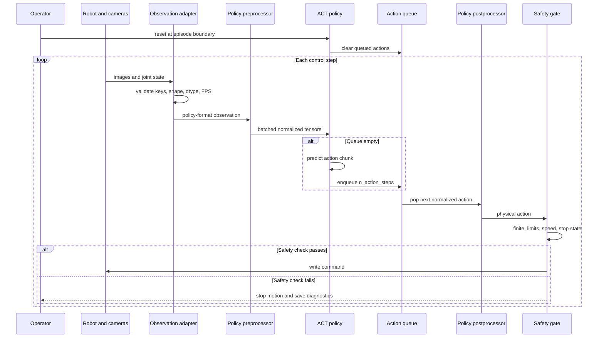

# Week 4 Day 7: LeRobot End-to-End Pipeline

## 1. Scope

This document connects collection, validation, Hub transfer, training, checkpoint release and robot deployment. Green nodes were exercised during Week 4 with PushT; yellow nodes are source-confirmed templates pending SO-101 hardware validation; red nodes are stop paths.

## 2. Artifact Flow

Raw Mermaid source: [`week04_day07/pipeline.mmd`](week04_day07/pipeline.mmd).

## 3. Deployment Runtime Sequence

For the Week 4 Tiny ACT, `chunk_size=10`, `n_action_steps=10` and temporal ensembling is disabled. The policy performs a new forward only when its queue is empty. These PushT dimensions and timing values are evidence for the software path, not an SO-101 deployment configuration.

## 4. Gates and Immutable Identifiers

| Boundary | Must freeze | Pass condition | Failure action |
| --- | --- | --- | --- |
| Collection → dataset | task text, robot/camera IDs, FPS, feature schema | Episodes save and visual sample is plausible | Stop and re-record |
| Dataset → Hub | health report, manifest, local hashes | No health-check FAIL | Do not upload/train |
| Hub → training | dataset repo and commit revision | Downloaded files pass health check | Reject revision |
| Training → checkpoint | code revision, config, seed, dataset revision | Finite updates and loadable checkpoint | Do not release |
| Checkpoint → Hub | model and processor hashes | Offline inference and queue checks pass | Inspect model/config |
| Hub → deployment | model repo and commit revision | Hashes and all processor files match | Refuse to load |
| Software → motion | calibration, observation/action schema, safety limits | Low-speed dry run and stop control pass | Keep robot disabled |

Never use a mutable `main` branch as the only experiment identifier. Record both dataset and model Hub commit hashes. A model release consists of `model.safetensors`, policy config, train config, preprocessor config/state and postprocessor config/state; copying only model weights is insufficient.

## 5. Command and Evidence Index

Exact command templates, inputs, outputs, gates and validation status are in [`week04_day07/command_index.md`](week04_day07/command_index.md).

| Stage | Week 4 evidence | Status |
| --- | --- | --- |
| Dataset schema | [Day 1 schema audit](week04_day01_dataset_schema.md) | Verified by code and metadata |
| Dataset acquisition/visualization | [Day 2 report](week04_day02_dataset_visualization.md) | Executed with pinned PushT revision |
| Training | [Day 3 report](week04_day03_tiny_act_training.md) | 50 optimizer steps on RTX 5070 |
| Checkpoint inference | [Day 4 report](week04_day04_offline_inference.md) | Executed on three fixed frames |
| Chunking and normalization | [Day 5 report](week04_day05_act_chunking.md) | Formula, queue and padding verified |
| Dataset gate | [Day 6 report](week04_day06_data_health.md) | 35 checks passed |
| Hub upload/download | CLI options confirmed locally | Not executed |
| SO-101 collection/deployment | LeRobot 0.4.4 entry points and config names confirmed | Hardware pending |

## 6. Known Gaps Before Week 5

- The training venv lacks optional package `rerun`; `lerobot-record` and `lerobot-teleoperate` fail during import until the hardware environment is completed.
- `lerobot-find-port` is interactive and immediately asks the operator to disconnect USB; it is not a passive `--help` command.
- Ports, camera indices, follower/leader IDs, calibration files and safety limits are not yet frozen.
- Hub authentication and private upload/download were not exercised; no token is stored in repository artifacts.
- The Tiny ACT was trained on one PushT episode for 50 steps and has no claimed task capability.
- The data health checker verifies structure and basic image validity, not demonstration semantics or 14-D joint meaning.

## 7. Week 4 Conclusion

Week 4 is complete and Green. The local PushT path has been exercised from pinned data through health checks, Tiny ACT training, checkpoint reload, preprocessing/postprocessing, action chunk generation and offline inference. External Hub transfer and physical SO-101 collection/deployment remain explicitly gated Week 5 work rather than implied successes.

